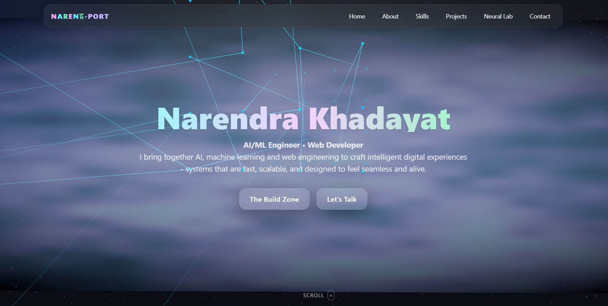

# Personal Portfolio - Narendra Khadayat

Welcome! & this is my personal portfolio, a fully interactive single-page application built with React and 3.js.

### [➡️ Portfolio View Live ](https://narendra-khadayat.vercel.app/) --

 
## Key Features

This portfolio is built from the ground up and includes several features:

* **3D NN Scene:** The Home background is a 3D scene rendered with **React 3 Fiber**, featuring a custom "Neural Network".
* **Animations:** Smooth scroll-based animations and micro-interactions powered by **GSAP (GreenSock Animation Platform)**.
* **Custom Shaders:** The background effects and interactive elements in the "Neural Lab" are created with custom **GLSL shaders**.
* **Dark/Light Mode:** A sleek toggle to switch between dark and light themes.
* **Functional Contact Form:** The contact form is fully integrated with **Formspree** to send emails directly to my inbox.
* **Fully Responsive Design:** A clean, modern layout that works seamlessly across all devices, built with **Tailwind CSS**.

## Tech Stack

This project was built using a modern, high-performance tech stack:

* **Framework:** [React](https://react.dev/) (with Vite)
* **Language:** [TypeScript](https://www.typescriptlang.org/)
* **3D Rendering:** [Three.js](https://threejs.org/) & [React Three Fiber](https://docs.pmnd.rs/react-three-fiber/getting-started/introduction)
* **Animation:** [GSAP](https://gsap.com/) & [Framer Motion](https://www.framer.com/motion/)
* **Styling:** [Tailwind CSS](https://tailwindcss.com/)
* **Deployment:** [Vercel](https://vercel.com/)

## Contact
Narendra Khadayat – Feel free to reach out!
---
